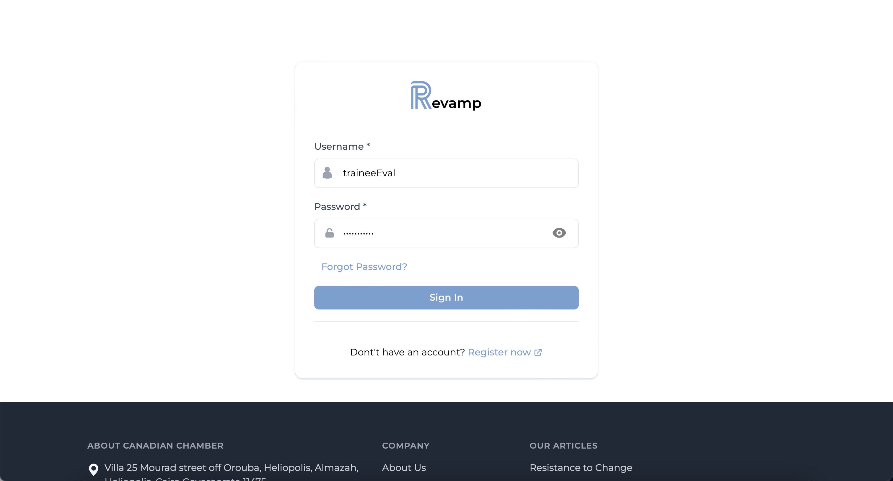
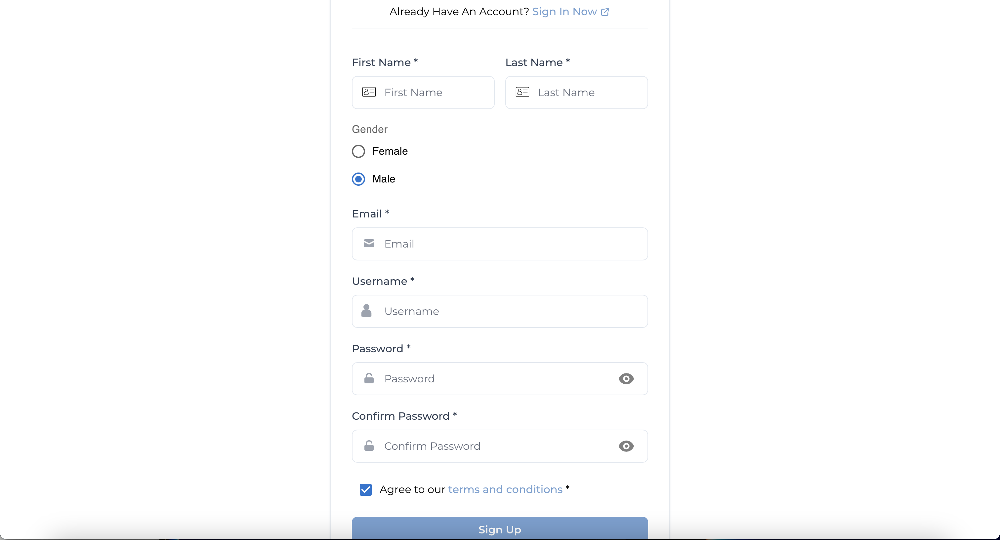
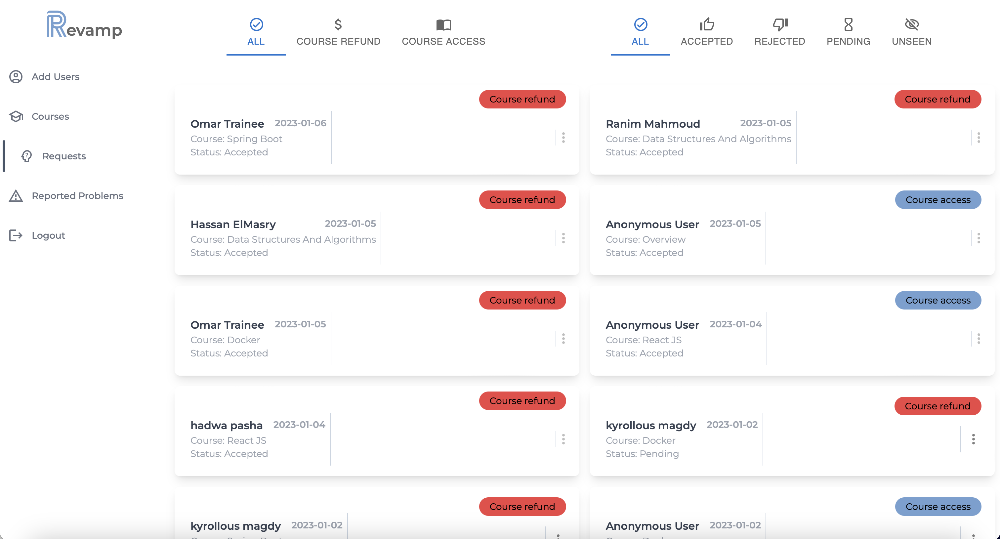

## Revamp

- Is an E-learning platform that provides various courses in all major and minor fields for students to buy.
  
- Provides a platform for instructors to post their content and make profit out of it.

## Motivation

- This Website was created as a group University
  (German University in Cairo) project for the course CSEN704 Course (Advanced Programming Lab).

- The purpose of creating such project is to learn and practice the MERN  (MongoDB , ExpressJS , ReactJS, NodeJS) Technology Stack in creating fullstack scalable web applications, learn how to follow a set of User and System Requirements to develop a fully functioning software, learn how to split the use-cases into tasks and distribute them among the team.

## Build Status

- The Current Build Of the project contains no bugs or malfunctions, however, for better UX the admin and the instructor need to be able to input a start date for the promotion inorder not to add a promotion on a specific day and the trainees must be prevented to view a course after they have requested a refund since they can simply get their certificate and view the course content before the admin responds to that request.

## Code Styles

- Standard coding style is used , however most functions and code blocks are documented for future reference.
- MVC (Model-View-Controller) is used : MVC (Model-View-Controller) is a pattern in software design commonly used to implement user interfaces, data, and controlling logic. It emphasizes a separation between the software's business logic and display. This "separation of concerns" provides for a better division of labor and improved maintenance..

## Tech/Frameworks

- [MongoDB](https://www.mongodb.com/home) was used as a noSQL database to store the models and information. 
- [ExpressJS](https://expressjs.com/) which is a minimal and flexible Node.js web application framework that provides a robust set of features for web and mobile applications with a myriad of HTTP utility methods and middleware at your disposal, creating a robust API is quick and easy.
- [ReactJS](https://reactjs.org/) which is a component based JavaScript library for building and developing user interfaces that provides reusability and flexibility.
- [NodeJS](https://nodejs.org/en/) which is an environment that permits the user to write normal JavaScript code that is highly performant and easy to use to build scalable network applications.
- [JavaScript](https://www.javascript.com/) was used to develop both the backend and the frontend codes.
- [Tailwind](https://tailwindcss.com/) was used for styling our html components.
- [Material-UI](https://mui.com/) was used for ready made components.
- [Stripe](https://stripe.com/) was used for the online payment.
  
## Features

#### - Students

- The platform allows users to buy courses and get certified upon completion of the course content.
- The platform also provides the user with videos on demand, allows the user to take notes while watching his registered courses, download those notes later as a pdf to review it, solve excersises to practice the content he just watched and upon submitting their answers they get immediate feedback.
- It also provides a platform for the students to ask their instructors about their inquiries and questions and report problems they faced.
- Moreover, students can request a full refund if they haven't attended more than 50% of the course.
- Futhemore, students can review their courses and instructors.
- Students can also navigate through the available courses, watch course outlines, check if the course is on sale and monitor reviews before buying a course.
- Students can also view their progress in a certain course they bought.

#### - Instructors

- Instructors can post their content to make profit out of it.
- Reply to user inquiries and questions.
- Create courses and provide excersises for the students to solve as a sort of practice.
- Add promotions on courses to improve their sales.
- They can add a biography about themselves to make their student know more information beforehand buying a course.
- They have access to statistics that gives them a sense of how they are doing at the moment and also provides comparisons with previous months and years sales to be able to pin down if they are improving their sales or actually quite the opposite.
- Instructors can report issues they face.
- Instructors can also monitor their reviews and their courses reviews.
- They also take a percentage of their courses sales.

#### - Admins

- Admins can grant refunds.
- Hand technical reports to the development team.
- Resolve issues.
- Put courses on sale to improve sales.
- Create accounts for instructors.
- Refund the courses for the students.
  
## Screenshots



- This is Revamp's login page where based on the stakeholder the navigation will differ.



- This is Revamp's sign up page where the trainees can register to become part of the platform.

#### - Trainee


- This is the trainee's navabar where if he clicks home he gets navigated to the homepage, if he clicks on my courses he will be navigated to view his courses , if he click on the FAQS he will be navigated to the FAQs page , if he hovers on the wallet he will view his own wallet, if he clicks on the profile icon he will be navigated to view his profile.
   


- This is the first part of the landing page of both guests and trainees , where users can search for courses based on the instructor name, course name or category, users can also see the companies that use Revamp.


- This is the second part of the landing page where users can see a testomonial of the ceo of Wuzzuf using revamp and the incentives of using the Revamp platform.


- This is the third part of the landing page where users can see incentives of using the Revamp platform.


- This is the fourth part of the landing page where users can view and select the most popular courses to help them find what best suits them.


- This is the search results page where users can search for courses or apply filters to narrow down their search, clicking on the view will navigate the user to the course details page where the user can view more information about the selected course.


- This is the first part of the course details page where the users can view information about the course like the content, title instructor etc., clicking on the youtube logo will allow the user to watch the course outline video and clicking on the go to course button will navigate the registered user to the course watch page.


- This is the second part of the course detailts page where the users can monitor the reviews or write a review about the course if they are registered in that course.


- This is the main part of the course watch page where users can watch the course content by selecting a view from the accordion on the right.


- This is the notes taking part while watching the video, this is done using the timestamp, so the user can recall in which lesson and they took the note.
  


- This is the part where students can ask questions and wait for the instructor to reply.


- This is the part where students can report a problem they faced with that course, the problems can be technical or financial or others.


- This is the part where students can check their progress in that course.


- This is the part where students can start solving the quiz and they are given hints beforehand.


- This is how the exam process looks like.


- This is the immediate feedback the students are given upon submitting their quiz solution, following they can navigate through the questions again to learn from their mistakes.


- This the Trainee's profile where he can edit his information, change his password and finally view his previous reports and their status.


- This is what the user views when they click on the FAQS tab, here they can find the most popular questions people ask when using Revamp.


- This is the website's footer where clicking on any field will navigate to the corresponding page in the canadian chamber website.

#### - Instructor


- This is the instructors's navabar where if he clicks dashboard he/she gets navigated to his/her dashboard, if he/she clicks on courses he/she will be navigated to view all courses ,if he/she clicks on Add course he/she will be navigated to the add course page, if he/she clicks on the FAQS he/she will be navigated to the FAQs page , if he clicks on the wallet he/she will view his/her own wallet, if he/she clicks on the profile icon he/she will be navigated to view his/her profile.


- This is the first part of the instructor Dashboard where he can view his submitted reports and view his students inquiries and reply to them.


- This is the second part of the instructor Dashboard where he can view his reviews as an instructor, 


- This is the instructor courses page where he/she can filter/search courses and clicking on the my courses button will filter only to view his/her courses. Moreover, the instructor can apply actions like viewing the course (navigating to the course details page) or apply promotion on courses to improve his sales.


- This is the instructor Add course where he starts off by entering the course details like the title and price. 
  


- This is the final part of the add course process where the instructor should add the course content by filling in the details of each section and the lessons of that section.


- This is the part where the instructor can add excersises for the trainees to practice.


- This is the part where the instructor can view his profile and edit his personal information as the biography.


- This is the part wher the instructor can view his performance and the money the company (revamp) owes him (the percentage of sales).

#### - Admin


- This is the part where the admin can add users to the platform based on agreements done.
  


- This is the part where the admin can view all the courses in the website and add promotions to the courses he/she desires.
  
 

- This is the part where the admin can view all the requests made by users, he can also accept/reject them.


- This is the part where the admin can view all the reports made on the platform and resolve or hand them to the development team (pend the problems).

## Database Models

- The First model is the user with 4 available roles 1.Trainee , 2.Corporate Trainee, 3.Instructor, this model holds all the information regarding that model like the name email password(hashed) etc.

- The Second model is the course which holds all the sections , excersises  and lessons that course has. Moreover, holds statistical information like the duration of each lesson and the duration of the whole course.

- The Third model is the Problems Model which holds all the information regarding the problems like the description  , date of submittion and the user who submitted that problem and finally the follow up if done by the user.

- The Fourth model is the Requests Model which holds all the information regarding the request like ths user who submitted that report , the date and the type of that request.

- The Fifth model is the invoice model which holds all the transaction information like the date and the user who issued that invoice and the the course related to that invoice.

## Code Examples

##### The Following examples highlight the best practices using react in the frontend to ensure the latest states and the best performance, and for the backend code is optimized to ensure fast responses and provide better user experience. 

-  Getting all courses :
  ```exports.getAllCourses = async (req, res, next) => {
  const currentPage = req.query.page || 1;
  const perPage = req.query.pageSize || 10;
  const search = req.query.search || "";
  let minPrice = req.query.minPrice || 0;
  let maxPrice = req.query.maxPrice || Number.MAX_VALUE;
  const rating = req.query.rating || 0;
  const subjects = req.query.subject;
  const iId = req.user? req.user.id:undefined;
  let query = {};
  if (subjects) {
    query = { subject: { $in: subjects } };
  }
  const countryCode = req.query.CC || "US";
  let countryDetails = await currencyConverter.convertCurrency(
    countryCode,
    "US"
  );
  let exchangeRate = countryDetails.rate;
  let symbol = countryDetails.symbol;

  minPrice = minPrice * exchangeRate;
  maxPrice = maxPrice * exchangeRate;
  let allCourses = await course
    .find({
      $and: [
        query,
        { discountedPrice: { $gte: minPrice } },
        { discountedPrice: { $lte: maxPrice } },
        { rating: { $gte: rating } },
        {
          $or: [
            { courseTitle: { $regex: search, $options: "i" } },
            { subject: { $regex: search, $options: "i" } },
            { instructorName: { $regex: search, $options: "i" } },
          ],
        },
      ],
    })
    .skip((currentPage - 1) * perPage)
    .limit(perPage)
    .select({
      _id: 1,
      courseTitle: 1,
      courseImage: 1,
      totalMins: 1,
      level: 1,
      courseDescription: 1,
      coursePrice: 1,
      summary: 1,
      discountedPrice: 1,
      discount: 1,
      discountStartDate: 1,
      discountEndDate: 1,
      courseImage: 1,
      rating: 1,
      instructor: 1,
      instructorName: 1,
      subject: 1,
    })
    .catch((error) => {
      res.status(500).json({
        message: "Fetching courses failed!",
      });
    });
  let courseCount = await course
    .find()
    .count()
    .catch((error) => {
      res.status(500).json({
        message: "Counting Courses Failed",
      });
    });
  countryDetails = await currencyConverter.convertCurrency("US", countryCode);
  exchangeRate = countryDetails.rate;
  allCourses.forEach((course) => {
    course.coursePrice = (course.coursePrice * exchangeRate).toFixed(2);
    course.discountedPrice = (course.discountedPrice * exchangeRate).toFixed(2);
  });
  let instructorCourses = [];
  if (iId && (req.user.role == "INSTRUCTOR" || req.user.role == "ADMIN")) {
    for (let i = 0; i < allCourses.length; i++) {
      if (allCourses[i].instructor == iId) {
        allCourses[i].mine = true;
        instructorCourses.push({ course: allCourses[i], mine: true });
      } else {
        allCourses[i].mine = false;
        instructorCourses.push({ course: allCourses[i], mine: false });
      }
    }
    return res.status(200).json({
      message: "Courses fetched successfully!",
      courses: instructorCourses,
      symbol: symbol,
      count: courseCount,
    });
  }
  res.status(200).json({
    message: "Courses fetched successfully!",
    courses: allCourses,
    symbol: symbol,
    count: courseCount,
  });
};
```
- Sending / Downloading a Certificate :
  ```const Certificate = forwardRef((props, ref) => {
  useImperativeHandle(ref, () => ({
    generatePDF2() {
      html2canvas(document.querySelector("#contentt"), {
        logging: true,
        profile: true,
        onclone: function (doc) {
          const hiddenDiv = doc.getElementById("contentt");
          hiddenDiv.style.display = "block";
          hiddenDiv.style.zIndex = "0";
          hiddenDiv.style.position = "fixed";
        },
        useCORS: true,
        allowTaint: true,
      }).then((canvas) => {
        const imgData = canvas.toDataURL("image/png");
        const pdf = new jsPDF("l", "px", "a1");
        pdf.addImage(imgData, "PNG", 0, 0);
        pdf.save("Certificate.pdf");
      });
    },
    sendEmail() {
      html2canvas(document.querySelector("#contentt"), {
        logging: true,
        profile: true,
        onclone: function (doc) {
          const hiddenDiv = doc.getElementById("contentt");
          hiddenDiv.style.display = "block";
          hiddenDiv.style.zIndex = "0";
          hiddenDiv.style.position = "fixed";
        },
        useCORS: true,
        allowTaint: true,
      }).then((canvas) => {
        const imgData = canvas.toDataURL("image/png");
        const pdf = new jsPDF("l", "px", "a1");
        pdf.addImage(imgData, "PNG", 0, 0);
        //pdf.save("Certificate.pdf");
        axios.post(
          "http://localhost:3000/user/sendCertificate",
          {
            url: canvas.toDataURL("image/jpeg", 0.5),
            courseId: props._id,
          },
          {
            headers: {
              Authorization: "Bearer " + localStorage.getItem("token"),
            },
          }
        );
      });
    },
  }));
  ```
  - Filters 
  ```
  const Filters = (props) => {
  const defaultFilterState = {
    ...props.prevState,
  };
  const ReducerFunction = (state, action) => {
    if (action.type === "SUBJECT") {
      const newSubject = {
        ...state,
        subjects: action.value,
      };
      return newSubject;
    } else if (action.type === "PRICE") {
      const newPrice = {
        ...state,
        price: action.value,
      };
      return newPrice;
    } else if (action.type === "RATING") {
      const newRating = {
        ...state,
        rating: action.value,
      };
      return newRating;
    } else if (action.type === "CLEAR") {
      return {
        subjects: [],
        price: null,
        rating: null,
      };
    }
  };

  const [filterState, dispatchFilter] = useReducer(
    ReducerFunction,
    defaultFilterState
  );
  const onSubmitHandler = () => {
    var newFilterState;
    if (filterState.price) {
      if (filterState.price.minValue > filterState.price.maxValue) {
        newFilterState = {
          ...filterState,
          price: {
            minValue: filterState.price.maxValue,
            maxValue: filterState.price.minValue,
          },
        };
        props.onConfirm(newFilterState);
      }
      else{
        props.onConfirm(filterState);
      }
      
    } else props.onConfirm(filterState);
  };
  const subjectChangeHandler = (Array) => {
    dispatchFilter({ type: "SUBJECT", value: Array });
  };
  const priceChangeHandler = (Range) => {
    console.log(Range)
    dispatchFilter({ type: "PRICE", value: Range });
  };
  const ratingChangeHandler = (Rating) => {
    dispatchFilter({ type: "RATING", value: Rating });
  };

  const clearHandler = () => {
    dispatchFilter({ type: "CLEAR" });
  };
  ```
## Environment Variables

 #### The following environment variables must be set for the platform to work properly.

 - DB_STRING
 - TOKEN_SECRET
 - EMAIL_SERVICE
 - EMAIL_HOST
 - EMAIL_PORT
 - EMAIL_CORPORATE
 - EMAIL_PASSWORD
 - STRIPE_PRIVATE_KEY
 - SUCCESS_URL
 - CANCEL_URL

## API Documentation

- The following links are for our API documentations
- https://www.postman.com/winter-crescent-614567/workspace/my-workspace/collection/22892151-70a82e2d-655a-4212-bd3f-dd34a108de46?action=share&creator=24106838&ctx=documentation
- https://www.postman.com/winter-crescent-614567/workspace/my-workspace/collection/22892151-837a7360-758a-47e4-92fd-683fc36d7d81?action=share&creator=24106838
- https://www.postman.com/winter-crescent-614567/workspace/my-workspace/collection/22892151-4090c077-8ea0-4be2-8729-1e2fe24865f8?action=share&creator=24106838
- https://www.postman.com/winter-crescent-614567/workspace/my-workspace/collection/22892151-feceb125-dcdc-440a-96fc-4efa2e83abf5?action=share&creator=24106838
- https://www.postman.com/winter-crescent-614567/workspace/my-workspace/collection/22892151-e5b4386a-bd53-46ce-93cd-7587384f2b8a?action=share&creator=24106838
- https://www.postman.com/winter-crescent-614567/workspace/my-workspace/collection/22892151-2e1331d8-c256-49af-9b2b-2e86bc9d9a1e?action=share&creator=24106838
- https://www.postman.com/winter-crescent-614567/workspace/my-workspace/collection/22892151-29b28c7b-f73c-4b0d-a8db-60e59890af26?action=share&creator=24106838

## Testing

- Testing was done using Postman (run the endpoint then check the response) no one implemented tests.

## Installation

- clone the repository `git clone https://github.com/Advanced-Computer-Lab-2022/MangaDB.git` or kindly download the zip folder from the repository.
- make sure you have NodeJS installed on your device [node](https://nodejs.org/en/).
- navigate to the backend source folder `cd backend/src`.
- download the dependencies `npm install` if it fails run `npm install --force`.
- now run the server `node index.js`.
- create a new terminal from the root directory from the top toolbar `Terminal --> new Terminal`.
- navigate to the frontend folder `cd frontend`
- download the dependencies `npm install` if it fails run `npm install --force`.
- now run the client `npm start`.

## Usage

- A link to a video which demonstrates in full details the usage of the website is provided as follows: https://drive.google.com/drive/folders/1pUp9wwP27zlFmCoXM5YEQpmNBY2diRcp?usp=share_link
- A link to a brief walkthrough through the website is provided as follows: https://drive.google.com/file/d/17Qm6OJwV0mSbJSJg-SA5sLmgAdnU2qn_/view?usp=share_link

## Contribute

- Promotion start date is needed since what if the admin or the instructor need to input a start date for the promotion to start like for example 30 days before christmas or something as they might not be available to create the promotion on that day.
- Prevent the user from requesting a refund then simply be able to watch the course and get the certificate before the admin responds.
- Implement Tests for the backend and for the frontend.

## License

- Apache License, Version 2.0 for stripe.

## Authors

- [Omar Moataz](https://github.com/OmarMoataz19)
- [Marwan Ashraf](https://github.com/ContractI9)
- [Michel Roauf](https://github.com/MichelRaouf)
- [Mina Magdy](https://github.com/mina0magdy)
- [Ahmed Reda](https://github.com/Ahmed-Reda-ELdemery)
